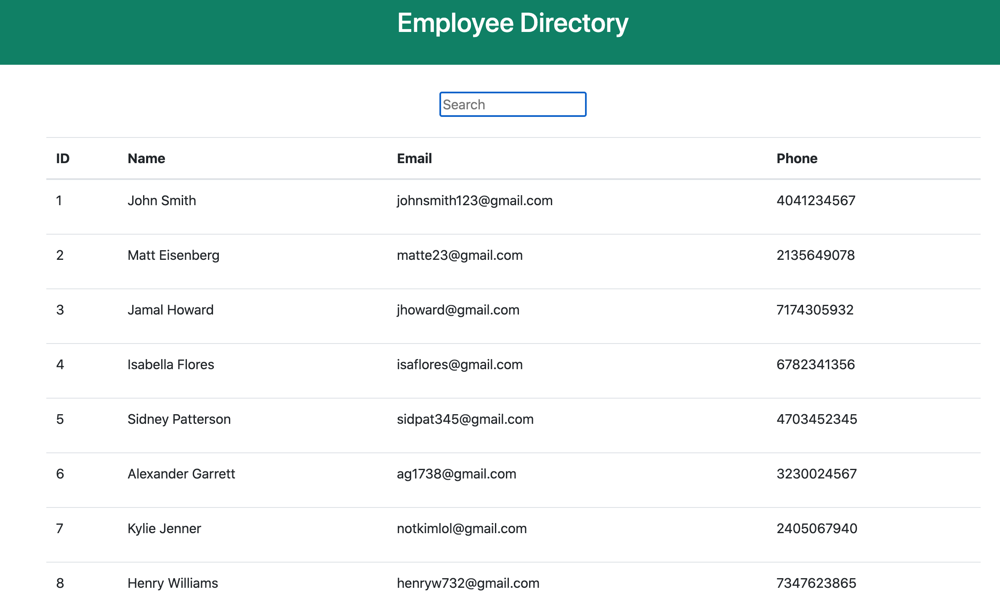

# employee-directory

## Description 

This project is a web app that will allow the user to keep view an employee directory. In this directory, the user can sort by the names of the employees alphabetically. They can also search for names or letters and the page will automatically update, as it is a single page application.

## Table of Contents

* [Installation](#installation)
* [Usage](#usage)
* [License](#license)

## Installation
This app can be accessed [here](http://patrickhannan.github.io/employee-directory).

However, if the user wants to locally host the app, they must download the files from this repository. Those can be accessed [here](https://github.com/patrickhannan/employee-directory).

Once the user downloads these files, they must open the files in VS Code. In VS Code, the user will run a new terminal. In the terminal, the user will change their working directory to the current directory. 

Run "npm install" to install the app.

## Usage 
*If the user uses the app locally, run the command npm start in the terminal, then localhost:3000 will be opened in a web browser.* 

Once in the app, the user will see a table with the headings id, name, email, and phone number for each employee. To sort by name, click on the name heading. To search, enter the desired search in the search bar and the page will update accordingly.

Below is a image of how the app will look.

## License

MIT License

Copyright (c) 2020 Patrick Hannan

Permission is hereby granted, free of charge, to any person obtaining a copy of this software and associated documentation files (the "Software"), to deal in the Software without restriction, including without limitation the rights to use, copy, modify, merge, publish, distribute, sublicense, and/or sell copies of the Software, and to permit persons to whom the Software is furnished to do so, subject to the following conditions:

The above copyright notice and this permission notice shall be included in all copies or substantial portions of the Software.

THE SOFTWARE IS PROVIDED "AS IS", WITHOUT WARRANTY OF ANY KIND, EXPRESS OR IMPLIED, INCLUDING BUT NOT LIMITED TO THE WARRANTIES OF MERCHANTABILITY, FITNESS FOR A PARTICULAR PURPOSE AND NONINFRINGEMENT. IN NO EVENT SHALL THE AUTHORS OR COPYRIGHT HOLDERS BE LIABLE FOR ANY CLAIM, DAMAGES OR OTHER LIABILITY, WHETHER IN AN ACTION OF CONTRACT, TORT OR OTHERWISE, ARISING FROM, OUT OF OR IN CONNECTION WITH THE SOFTWARE OR THE USE OR OTHER DEALINGS IN THE SOFTWARE.